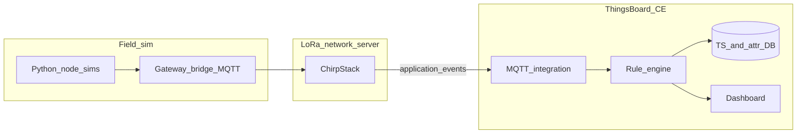

# Technical Report — SWAPD 453 Assignment 2 — Crop Disease Early Warning Network (ThingsBoard Track)

**Course:** IoT Applications Development — Spring 2026  
**Platform:** ThingsBoard Community Edition + ChirpStack v4 (Docker)  
**Repository root:** `IoT-Crop-Disease-Warning--V2`

> **Submission note:** Replace bracketed fields with your roster information. Export this document to PDF (`pandoc ASSIGNMENT2_REPORT.md -o ASSIGNMENT2_REPORT.pdf`) or print from your editor to satisfy the PDF deliverable.

---

## 1. Title page data

- **Team / student name(s):** [fill in]  
- **Student ID(s):** [fill in]  
- **Course & section:** SWAPD 453  
- **Submission date:** [fill in]

---

## 2. System architecture

The solution follows the brief’s edge → network server → IoT platform layering:

1. **Simulated LoRaWAN field devices** publish EU868 gateway-bridge MQTT frames into Mosquitto (`node_simulator.py` + `run_all_nodes.py`).
2. **ChirpStack v4** validates MIC, routes through two logical gateways, applies the JavaScript payload codec, and emits `application/+/device/+/event/up`.
3. **ThingsBoard CE** subscribes via **MQTT integration**, parses uplinks with the uplink data converter, assigns device types `Zone1_Sensor` / `Zone2_Sensor`, and executes the **Disease Risk Engine** rule chain storing telemetry + issuing alarms/email hooks.
4. **OTA** flows through ThingsBoard firmware packages assigned only to `Zone2_Sensor`. Each zone‑2 node runs `thingsboard_tb_sidecar.py` using device access tokens for MQTT, publishing `fw_state`.

Include an architecture diagram in your submission PDF (reuse the mermaid sketch below if helpful):

---

## 3. LoRaWAN simulation

### 3.1 Docker + ChirpStack

- Compose file: [`chirpstack/chirpstack-docker/docker-compose.yml`](chirpstack/chirpstack-docker/docker-compose.yml)  
- Gateway activator: [`gateway_activator.py`](chirpstack/chirpstack-docker/gateway_activator.py) maintains online gateway stats.
- **Screenshots for your PDF:** ChirpStack *Applications / Devices / Gateways / Live LoRaWAN frames* after registration.

### 3.2 Nodes, cadence, gateways

- Ten devices defined in [`config/devices.json`](chirpstack/chirpstack-docker/config/devices.json): five per zone, unique keys, EUIs align with JavaScript zone map.
- `run_all_nodes.py` now defaults to **300 s** cadence (assignment §3.1).
- Deterministic weather jitter uses **seeded RNG** per node (`--seed` / CRC mix in `node_simulator.py`).
- Zone 1 nodes mix `NORMAL`, `BUILDUP`, `RAINFALL`; zone 2 rotates modes automatically every 20 uplinks to dramatize epidemiological curves.

### 3.3 Payload & codec

Binary payload: `struct.pack(">hBBH", temp*100, hum, leaf, rain*10)` documented in `node_simulator.py`.

ChirpStack codec file: [`thingsboard/chirpstack/payload_codec.js`](../thingsboard/chirpstack/payload_codec.js).

---

## 4. ThingsBoard provisioning

### 4.1 Containers & ports

Extended compose adds **ThingsBoard**:

| Service | Host ports | Notes |
|---------|------------|-------|
| ChirpStack UI | `8080` | Existing |
| ThingsBoard UI | `9090` | [`docker-compose.yml`](chirpstack/chirpstack-docker/docker-compose.yml) |
| Mosquitto | `1883` | Shared broker |
| TB device MQTT | `11883` → TB container `1883` | For device tokens / integrations |

### 4.2 MQTT integration + converter

- Instructions: [`thingsboard/integrations/INTEGRATION_SETUP.md`](../thingsboard/integrations/INTEGRATION_SETUP.md)
- Converter JS: [`thingsboard/integrations/chirpstack_uplink_converter.js`](../thingsboard/integrations/chirpstack_uplink_converter.js)
- Device profiles: [`thingsboard/device_profiles/README.md`](../thingsboard/device_profiles/README.md)

Screenshots to capture: integration configuration page, converter tab, auto-created devices list.

### 4.3 Customers & security bonus

Optional hardening steps documented under [`thingsboard/security/SECURITY_BONUS.md`](../thingsboard/security/SECURITY_BONUS.md).

---

## 5. Disease Risk Engine

### 5.1 Modeling assumptions

Rule chain script file: [`thingsboard/rule_engine/disease_risk_script.js`](../thingsboard/rule_engine/disease_risk_script.js) (paste into a **Transform** node after **Get Attributes** retrieving `riskEngineState`).

Timed logic:

| Risk | Implementation detail |
|------|----------------------|
| LOW | Instant rule per brief OR streak counters reset |
| MODERATE | Humidity 70–85 % & temperature 15–25 °C sustained for **36** consecutive uplinks (~3 h @300 s) |
| HIGH | Humidity >85 % & temperature 18–25 °C sustained for **72** uplinks (~6 h) |
| CRITICAL | HIGH streak satisfied & leaf wetness >8 h & rolling rainfall sum >5 mm across last **288** uplinks (~24 h) |

Persisted state JSON (`riskEngineState`) tracks streaks + rain ring buffer to survive restarts.

### 5.2 Outputs & alerting

Telemetry keys saved: `temperature`, `humidity`, `leaf_wetness`, `rainfall`, `risk_level`, `rain_sum_24h`.

Boolean `raiseFarmerAlarm` triggers when risk escalates into HIGH/CRITICAL. Wire this to **Create Alarm** and/or **Email** after configuring SMTP (`Settings → Mail`).

### 5.3 Samples

Include table in final PDF with staged readings showing each risk plateau (export from ThingsBoard Latest telemetry widget).

---

## 6. Dashboards

Guided widget list: [`thingsboard/dashboards/FARMER_DASHBOARD.md`](../thingsboard/dashboards/FARMER_DASHBOARD.md).

Export JSON into `thingsboard/artifacts/exports/dashboard_farmer.json`.

---

## 7. OTA lifecycle & rollback

### 7.1 Firmware artefact

Example payload: [`thingsboard/ota/sample_firmware_payload/thresholds_v2.json`](../thingsboard/ota/sample_firmware_payload/thresholds_v2.json) zipped per README.

### 7.2 Device-side handler

`thingsboard_tb_sidecar.py` (spawned from `run_all_nodes.py` when valid tokens exist) walks through `fw_state = DOWNLOADING → DOWNLOADED → VERIFIED → UPDATING → UPDATED`. Setting `TB_OTA_SIMULATE_FAIL=1` forces FAILURE for demonstrations.

### 7.3 Automatic rollback monitor

Script [`thingsboard/scripts/rollback_watchdog.py`](../thingsboard/scripts/rollback_watchdog.py) inspects Zone2 telemetry via REST; exit code `3` signals manual firmware removal per UI instructions.

Design rationale captured in [`thingsboard/rule_engine/OTA_ROLLBACK_NOTE.md`](../thingsboard/rule_engine/OTA_ROLLBACK_NOTE.md).

### 7.4 Logs & evidence

Collect ThingsBoard **Rule chain debug events**, device telemetry timelines, and script stdout for the submission appendix.

---

## 8. Security demonstration (bonus)

Procedure summary + tooling:

- Rogue device MQTT attempt: [`thingsboard/scripts/rogue_mqtt_client.py`](../thingsboard/scripts/rogue_mqtt_client.py)
- Expanded narrative: [`thingsboard/security/SECURITY_BONUS.md`](../thingsboard/security/SECURITY_BONUS.md)

---

## 9. Challenges & lessons learned

Document your team-specific hurdles (port collisions, ChirpStack codec caching, ThingsBoard first-boot delays, SMTP provider throttling, TLS capture on Windows loopback, translation between assignment PDF inconsistencies such as 15 vs 10 nodes — this repository follows the **ThingsBoard** brief with **10** devices).

---

## 10. Deliverables mapping

| Deliverable | Location / command |
|-------------|---------------------|
| Source zip | `python scripts/build_submission_zip.py` |
| Readiness checks | `python scripts/verify_assignment_ready.py` (optional `--tb` `--docker`) |
| Export TB JSON (dashboards + rule chains) | `python scripts/export_tb_artifacts.py` |
| Report PDF (pandoc) | `python scripts/build_report_pdf.py` |
| Demo video storyboard | [`docs/DEMO_VIDEO_SCRIPT.md`](DEMO_VIDEO_SCRIPT.md) |
| README | [`README.md`](../README.md) |
| Requirements | [`chirpstack/chirpstack-docker/requirements-assignment.txt`](../chirpstack/chirpstack-docker/requirements-assignment.txt) |

---

## Appendix A — Environment variables quick reference

| Variable | Purpose |
|----------|---------|
| `CHIRPSTACK_REST_TOKEN` | Optional API key; `simulate_uplink.py` publishes via **MQTT**, not REST |
| `THINGSBOARD_MQTT_HOST` / `THINGSBOARD_MQTT_PORT` | Sidecar connectivity |
| `ENABLE_TB_SIDECARS` | `0` disables TB children even if tokens exist |
| `TB_OTA_SIMULATE_FAIL` | Force FAILED `fw_state` |
| `TB_URL`, `TB_USERNAME`, `TB_PASSWORD`, `TB_ZONE2_PROFILE_ID` | `rollback_watchdog.py` |

---

## Appendix B — Grading self-check (ThingsBoard rubric)

- [ ] §3.1 — ChirpStack Docker, 10 nodes, 2 gateways, 5 min cadence, realistic trends, screenshots  
- [ ] §3.2 — TB CE, MQTT integration + converter, profiles, rule chain, telemetry keys, notifications, dashboard  
- [ ] §3.3 — OTA package, Zone2 targeting, device handler + states, rollback evidence  
- [ ] §3.4 — Optional security items  
- [ ] §4 — PDF report, ZIP, video

Good luck with demonstrations—make sure every teammate can narrate the rule chain and OTA flow.
